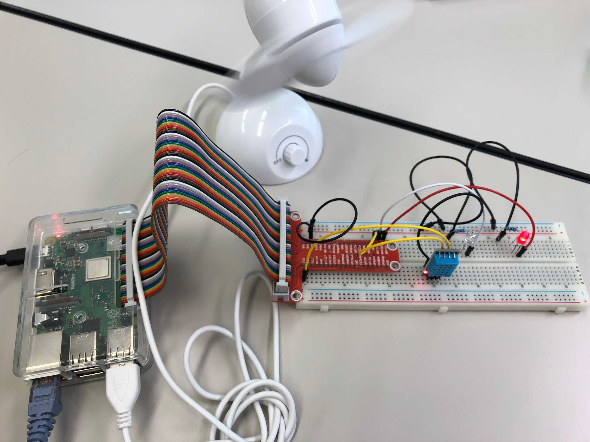

# r3g5
Breeding Support System 飼育支援システムのリポジトリです

このシステムは、自宅でペットを飼っている人々をサポートするためのシステムとして開発されました。
部屋のペットの側にRaspberry Piに接続した温度湿度センサーを置き、周囲の温度および湿度の値を10秒ごとに取得し、その変化をWebページにグラフの形で表示します。
ユーザがWebページに温度の閾値の範囲を設定しておくと、ユーザがWebページを開いている端末に通知を送信します。

開発は4名のチームで行い、私は主としてjavascriptを用いたウェブページへの動的な表示を担当しました。

## システムについて
* [Webサイトのスクリーンショット](doc/Website/README.md)

## システムの動作の様子

